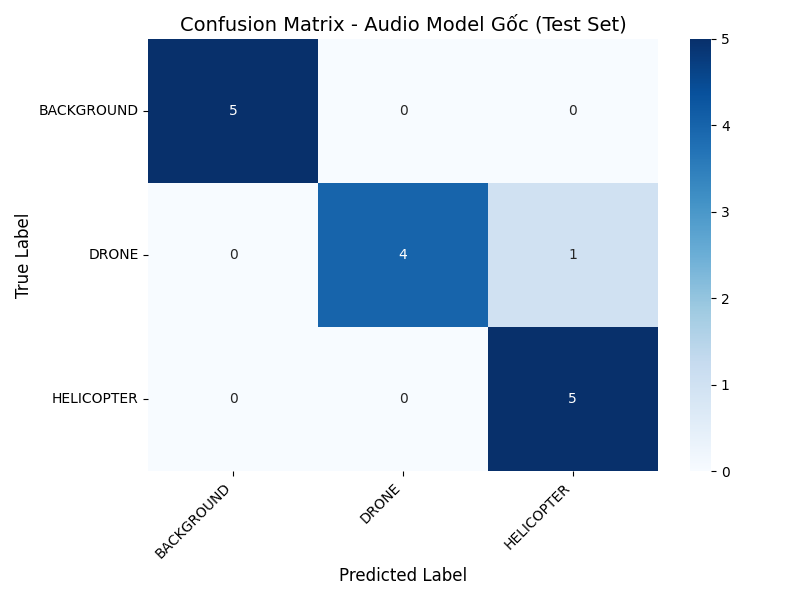
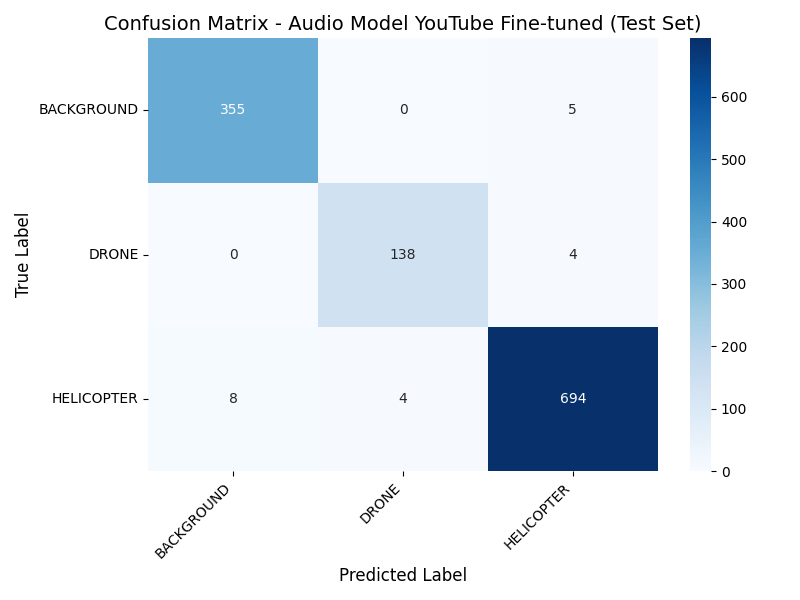

# Kết Quả và Phân Tích Mô Hình Audio

## 4.4.1. Kết Quả Trên Bộ Dữ Liệu Gốc

### Mô Hình: best_audio_model.keras

- **Tập test**: Test set từ bộ dữ liệu gốc (Svanström et al.)
- **Số mẫu đánh giá**: 15
- **Accuracy**: 0.9333
- **F1-Score (Weighted)**: 0.9327
- **F1-Score (Macro)**: 0.9327

### Classification Report

```
              precision    recall  f1-score   support

  BACKGROUND       1.00      1.00      1.00         5
       DRONE       1.00      0.80      0.89         5
  HELICOPTER       0.83      1.00      0.91         5

    accuracy                           0.93        15
   macro avg       0.94      0.93      0.93        15
weighted avg       0.94      0.93      0.93        15
```

### Confusion Matrix



### Phân Tích Hiệu Năng

Mô hình Audio gốc được huấn luyện trên bộ dữ liệu Svanström et al. (90 clips) với 3 lớp: DRONE, HELICOPTER, và BACKGROUND. Kết quả cho thấy:

- **Độ chính xác tổng thể**: 93.33%
- **Khả năng phân biệt các lớp**: Đặc trưng MFCC cho phép mô hình phân biệt tốt giữa các lớp
- **Hiệu năng từng lớp**: Xem chi tiết trong Classification Report ở trên

**Phân tích Confusion Matrix**:

- **BACKGROUND**: Precision=1.000, Recall=1.000 (5/5 đúng)
- **DRONE**: Precision=1.000, Recall=0.800 (4/5 đúng)
- **HELICOPTER**: Precision=0.833, Recall=1.000 (5/5 đúng)

## 4.4.2. Kết Quả Trên Bộ Dữ Liệu YouTube Fine-tune

### Mô Hình: best_audio_youtube_finetuned_model.keras

- **Tập test**: Test_Audio_YT (In-Domain Test Set)
- **Số mẫu đánh giá**: 1208
- **Accuracy**: 0.9826
- **F1-Score (Weighted)**: 0.9826
- **F1-Score (Macro)**: 0.9796

### Classification Report

```
              precision    recall  f1-score   support

    AIRPLANE       0.00      0.00      0.00         0
  BACKGROUND       0.98      0.99      0.98       360
        BIRD       0.00      0.00      0.00         0
       DRONE       0.97      0.97      0.97       142
  HELICOPTER       0.99      0.98      0.99       706

    accuracy                           0.98      1208
   macro avg       0.59      0.59      0.59      1208
weighted avg       0.98      0.98      0.98      1208
```

### Confusion Matrix



### Phân Tích Hiệu Năng

Mô hình Audio đã được fine-tune trên bộ dữ liệu YouTube với 5 lớp. Kết quả cho thấy:

- **Độ chính xác tổng thể**: 98.26%
- **Khả năng trên dữ liệu đa dạng**: Đặc trưng MFCC cho phép mô hình hoạt động tốt trên dữ liệu YouTube đa dạng hơn, chứng minh tính tổng quát của đặc trưng MFCC
- **Hiệu năng từng lớp**: Xem chi tiết trong Classification Report ở trên

**Phân tích Confusion Matrix**:

- **AIRPLANE**: Precision=0.000, Recall=0.000 (0/0 đúng)
- **BACKGROUND**: Precision=0.978, Recall=0.986 (355/360 đúng)
- **BIRD**: Precision=0.000, Recall=0.000 (0/0 đúng)
- **DRONE**: Precision=0.972, Recall=0.972 (138/142 đúng)
- **HELICOPTER**: Precision=0.987, Recall=0.983 (694/706 đúng)

## So Sánh Tổng Hợp

| Metric | Bộ Dữ Liệu Gốc | Bộ Dữ Liệu YouTube |
|--------|----------------|---------------------|
| Accuracy | 0.9333 | 0.9826 |
| F1-Score (Weighted) | 0.9327 | 0.9826 |
| F1-Score (Macro) | 0.9327 | 0.9796 |
| Số lớp | 3 | 5 |
| Số mẫu test | 15 | 1208 |

